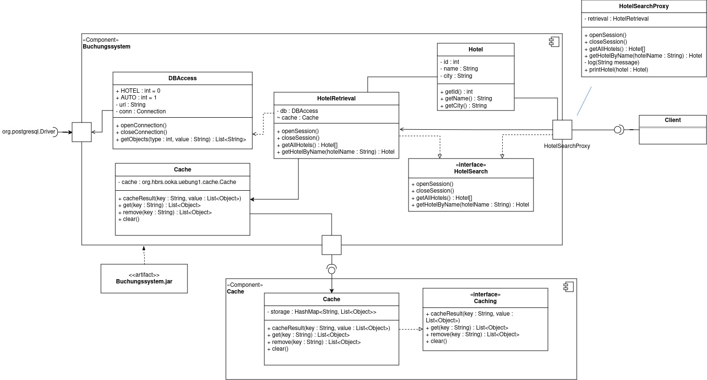

# Übungsblatt Nr. 1

## Aufgabe 1

### Allgemeine Fragen
> **1. Welche Aufgabe haben Ports im Kontext eines Komponentendiagramms?** 
> Recherchieren sie dieses Konzept anhand der Quelle von (Rupp, 2012), Kapitel 9.1.3 und 9.4.3 (siehe Auszug in LEA, Ordner Literatur zu Kapitel 1)

Ports dienen als **Kommunikationsschnittstellen**, welche den Classifier nach außen abkapseln.
Sie übernehmen die Interaktion zwischen den internen Strukturen des Classifieres und dessen Umgebung aus.
Das Ziel des Ports ist es somit, den Classifier auf ihre Ports zu reduzieren.

Weiterhin können Ports Zusatzaufgaben wie **Filterung, Caching, Protokollüberwachung, und Logging** übernehmen.

> **2. Wie könnte man deren Aufgabe für eine Komponente in Java implementieren? (Siehe dazu auch die Anforderung FA0)**

Zur Implementierung eines Ports in Java eignet sich das Proxy-Design-Pattern, da ein Proxy sich vor das Subjekt schaltet und dessen Zugriff kontrolliert.
Hierbei gibt es eine Proxy-Klasse und eine Subjekt-Klasse. 
Beide Klassen implementieren dasselbe Interface.
Zusätzlich besitzt der Proxy eine Instanz der Subjekt-Klasse und agiert auf dieser mit den aufgerufenen Methoden.

> **3. Wie können benötigte bzw. angebotene Interfaces injiziert bzw. entnommen werden?**

Benötigte bzw. angebotene Interfaces können injiziert bzw. entnommen werden, indem nach dem Proxy-Design-Pattern die Interfaces sowohl vom Subject als auch vom Proxy überschrieben werden.
Anschließend könnte der Proxy direkt instanziiert und über die implementierten Methoden verwendet werden.
---

> ### FA0
> Implementieren sie das Port-Konzept nach den Vorgaben bzw. Überlegungen gemäß (Rupp, 2012).
> **Welches Design Pattern sollte hier verwendet werden, um die notwendige Delegation zwischen internen und externen Verhalten zu realisieren?**

Zur Implementierung eines Ports in Java eignet sich das Proxy-Design-Pattern, da ein Proxy sich vor das Subjekt schaltet und dessen Zugriff kontrolliert.
(siehe `Allgemeine Fragen --> 2.`)

> ### FA1
> Offensichtlich ist die Ausgabe der Klasse `DBAccess` nicht sonderlich objektorientiert!
> Ihre Aufgabe soll es daher sein, die Ausgabe so zu transformieren, dass sie über die öffentliche Schnittstelle der Komponente Buchungssystem nur Objekte vom Typ `Hotel` zurückliefern.
> Die Attribute der Klasse `Hotel` sind entsprechend selber zu bestimmen, die Klasse selber ist in einem separaten Subsystem zu verlagern. 
> **Muss das Interface `Hotelsuche` ggf. noch um weitere Methoden erweitert werden?**
> Beachten sie dazu auch die Tutorial-Ausgabe der Klasse `DBAccess`!
> **Gibt es eine dedizierte Reihenfolge beim Aufruf der Methoden des Interfaces?**

Das provided Interface `HotelSearch` sollte um einige Funktionen erweitert werden, allerdings sind diese nicht streng vorgeschrieben.
Lediglich die Methode `closeSession()` zum Beenden der Verbindung zur Datenbank wird explizit vorausgesetzt (siehe Ausgaben des Mini-Tutorials).

Mögliche weitere Methoden sind beispielsweise:
- `getAllHotels() : List<Hotel>`
- `getHotelById(id:Integer) : Hotel`
- `getHotelsByCity(city:String) : List<Hotel>`

Eine Suche/Filterung per Java wäre allerdings Bad-Practise, weshalb zur Umsetzung dieser zusätzlichen Methoden weitere SQL-Queries bzw. eine modifizierte `DBAccess`-Klasse verwendet werden müssten.

Die `DBAccess`-Klasse erfordert eine dedizierte Reihenfolge zum Aufrufen der Methoden des Interfaces.
Als Erstes muss nämlich mit `openSession()` eine Verbindung zur Datenbank hergestellt werden.
Danach können alle anderen hier zuvor aufgelisteten Methoden in beliebiger Reihenfolge aufgerufen werden, da es sich dabei lediglich um lesende Zugriffe ohne Seiteneffekte handelt.
Nur die Methode `closeSession()` muss ganz als Letztes aufgerufen werden, um die Verbindung zur Datenbank wieder zu trennen.

> ### FA2
> Die Komponente Buchungssystem benötigt ferner eine Referenz vom Typ `Caching`, mit der die interne Klasse `HotelRetrieval` die Ergebnisse in einem Cache zwischenspeichern kann.
> Von außerhalb der Komponente muss also eine entsprechende Referenz erzeugt werden und über den Port injiziert werden. 
> **Ist die Schnittstelle Caching hinreichend modelliert oder fehlen auch hier Methoden?**
> Implementieren sie die Implementierung eines konkreten Cache rudimentär.

Da ein Cache-System eine sehr wichtiger Bestandteil in sehr vielen Anwendungen ist, könnte argumentiert werden, dass das abgebildete Diagramm den Cache hinreichend modelliert, da dieser Bestandteil nicht die eigentliche Business-Logik stark beeinflussen sollte.
Für eine grobe Skizze **zur Vermittlung der relevanten Aspekte der Anwendung könnte dies also völlig ausreichen**.
Für eine technisch genaue Modellierung fehlen allerdings **Methoden um bspw. Elemente zum Cache hinzuzufügen, zu lesen oder zu löschen**.

> ### FA3
> Überlegen sie auch einen Mechanismus, damit `HotelRetrieval` stets zumindest scheinbar ohne Probleme (z.B. keine NullPointer-Exceptions) auf den Cache zugreifen kann, auch wenn keine konkrete Referenz gesetzt ist.
> Ein etwaiges Fehlerhandling darf dabei nicht von der Klasse `HotelRetrieval` übernommen werden.

Der Cache kann in `HotelRetrieval` instanziiert werden. 
In dem `HotelSearchProxy` kann dann darauf zugegriffen werden: `retrieval.cache`.
So kann die Caching-Logik sowie die Fehlerbehandlung der Caches in der `HotelSearchProxy`, also in der Port-Klasse, durchgeführt werden.

> ### R1
> Modellieren Sie die resultierenden Klassen und die Abhängigkeiten ihrer gesamten Software als ein Klassendiagramm nach der UML. 
> Betrachten sie auch das Komponenten-Diagramm: 
> Um welche externe Komponente könnte man dieses erweitern?
> Falls Sie eine Erweiterung sehen, dann modellieren die Erweiterung entsprechend.

